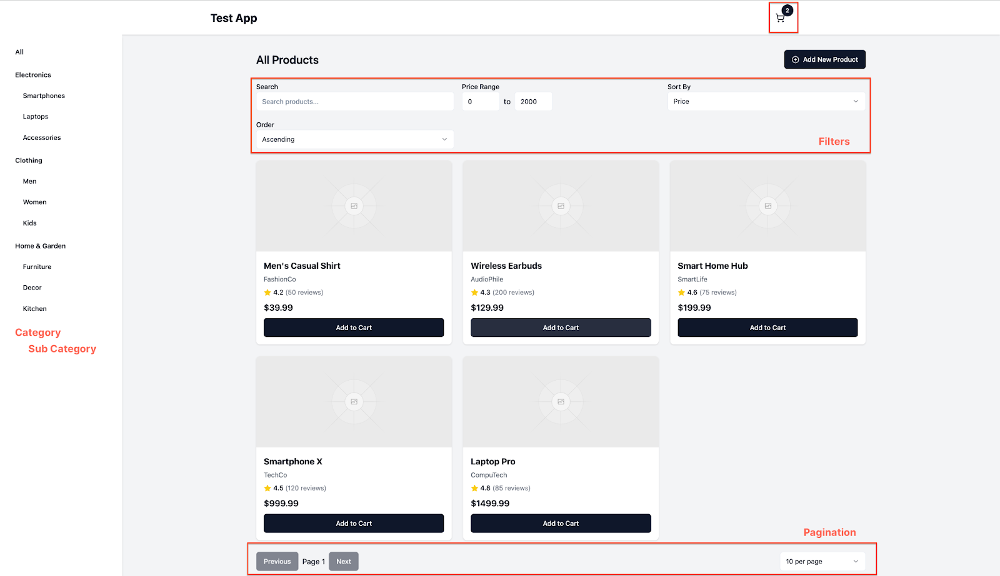
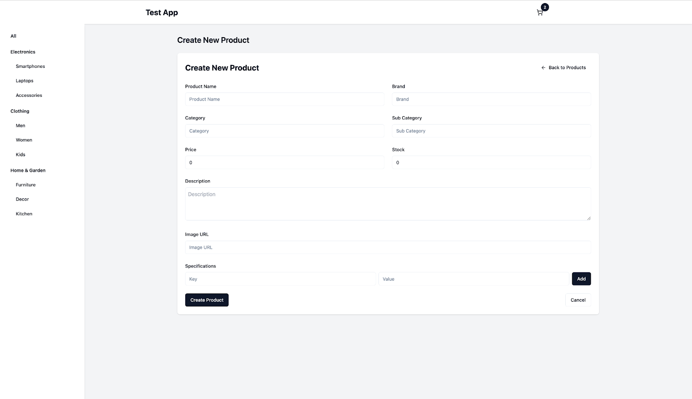
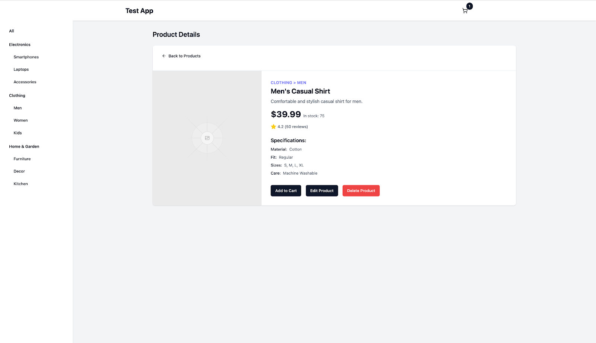
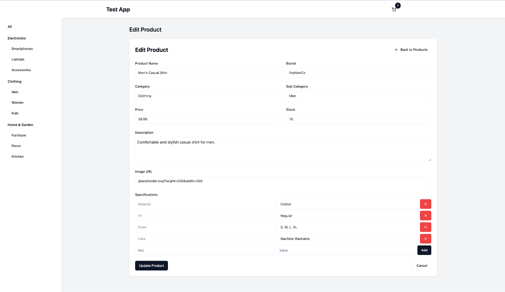
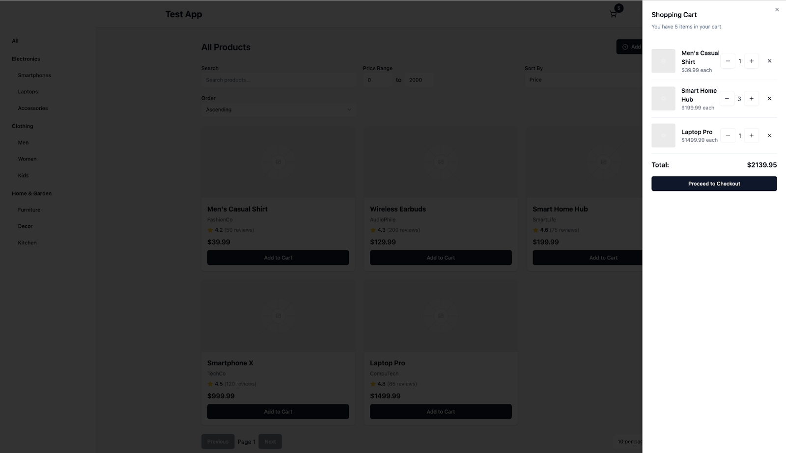

# Dot Frontend Engineer Take-Home Assignment

## Overview

This is a take-home assignment for the Frontend Engineer position at Dot. You'll be building a responsive e-commerce product catalog application that demonstrates your skills in frontend development, API integration, and clean code practices.

## Project Requirements

### Technical Stack

- React (Create your SPA using either Vite or Next.js)
- TypeScript
- TanStack Query for data fetching
- Unit testing framework of your choice

### Core Features to Implement

1. **Product Listing Page**

   - Implement pagination
   - Add filtering capabilities
   - Include search functionality

2. **Product Management Page**

   - Display product information
   - Create new product
   - Implement edit functionality
   - Implement delete functionality

3. **Shopping Cart**
   - Add to cart functionality
   - Frontend-only implementation (no backend required)
   - Cart drawer that opens on CartIcon click

### Technical Requirements

1. **Responsive Design**

   - Must work well on both desktop and mobile devices
   - Follow provided visual guidelines for layout

2. **API Integration**

   - Implement proper error handling
   - Use TanStack Query for data fetching
   - API documentation available at `http://localhost:{port}/api-docs`

3. **Code Quality**
   - Use TypeScript for type safety
   - Write clean, well-documented code
   - Include basic unit tests for critical components

## Getting Started

1. In the provided zip folder, locate the server directory
2. DO NOT modify any code in the server directory
3. Start the server following its README instructions
4. Create your frontend application in a separate directory

## API Access

- The API documentation will be available at `http://localhost:{port}/api-docs`
- Server code is provided in the zip folder
- Explore the API documentation before starting development

## Design Guidelines

Besides the guides above, no Figma design is provided, but follow these principles:

1. **UI Expectations**

   - Create a clean, functional interface
   - Ensure proper alignment and spacing
   - Use consistent color scheme
   - Focus on minimalist, intuitive design

2. **Key Layouts to Implement**
   - Product List view
   - Add New Product form
   - Product Detail view
   - Edit Product form
   - Cart drawer

-
- 
  Product Listing
- 
  Create Product
- 
  Product Detail
- 
  Edit Product
- 
  Cart
-

Remember: Focus on functionality and code quality rather than elaborate visual design.

## Submission Requirements

1. Create a new GitHub repository for your project

2. Include in your README:

   - Setup instructions
   - Your assumptions and design decisions
   - Additional features you implemented
   - Areas you would improve given more time

3. Send the GitHub repository link when complete

## Evaluation Criteria

Your submission will be evaluated on:

1. **Functionality**

   - Complete implementation of required features
   - Proper API integration
   - Working responsive design

2. **Code Quality**

   - Clean, well-organized code
   - Effective use of TypeScript
   - Code maintainability

3. **Technical Decisions**

   - Appropriate use of React patterns
   - Error handling implementation
   - State management approach

4. **Testing**
   - Presence of unit tests
   - Test quality and coverage

## Time Allocation

- You have one week to complete the assignment
- It's acceptable to not complete everything
- Focus on demonstrating your strengths and coding style

## Notes

- Prioritize functionality over visual polish
- Document any assumptions you make
- Focus on code quality and maintainability
- Don't modify the provided server code

Good luck with your implementation! If you have any questions before starting, please reach out to the hiring team.
